# Docker搭Gitlab

# 使用阿里雲

建立資料夾

```shell
cd /home
mdkir gitlag
vim docker-compose.yml
```

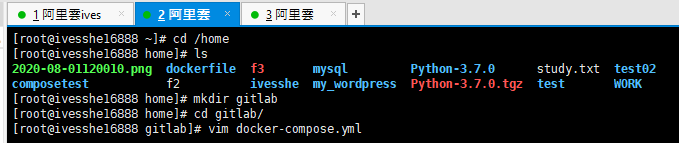

# docker-compose.yml

docker-compose.yml內容

```shell
version: "3.6"
services:
  gitlab:
    image: gitlab/gitlab-ce:latest
    restart: always
    container_name: gitlab
    ports:
      - '18080:80'
      - '1443:443'
      - '122:22'
    volumes:
      - '/gitlab/data:/var/opt/gitlab'
      - '/gitlab/logs:/var/log/gitlab'
      - '/gitlab/config:/etc/gitlab'
networks:   # 這兩行可以不加，暫時沒用到
  devel-net:      
```

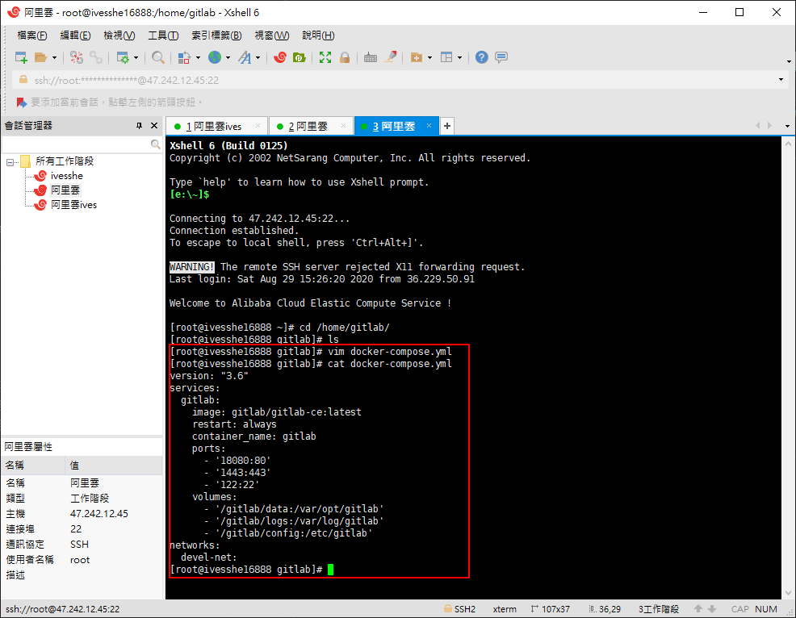

# 在存放docker-compose.yml檔案的目錄下，有以下指令

會以該資料夾放的docker-compose所寫的內容
```shell
# 建立及背景啟動
docker-compose up -d

# 卸載
docker-compose down

# 停止gitlab
docker-compose stop 

# 啟動gitlab
docker-compose start 

# 重啟gitlab
docker-compose restart 

# 進入執行中的gitlab
docker-compose exec gitlab bash
```

# 啟動服務

```shell
docker-compose up -d
```

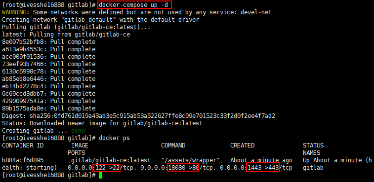


## 追蹤日誌

想要看執行中的容器日誌，可以透過 log 指令來 trace

```shell
docker-compose logs -f gitlab
```

# 開啟端口

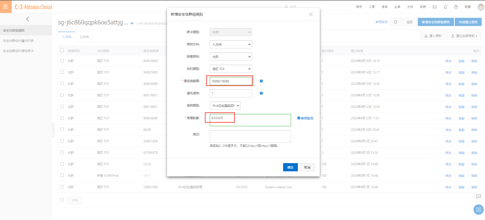

# 阿里雲上連接失敗

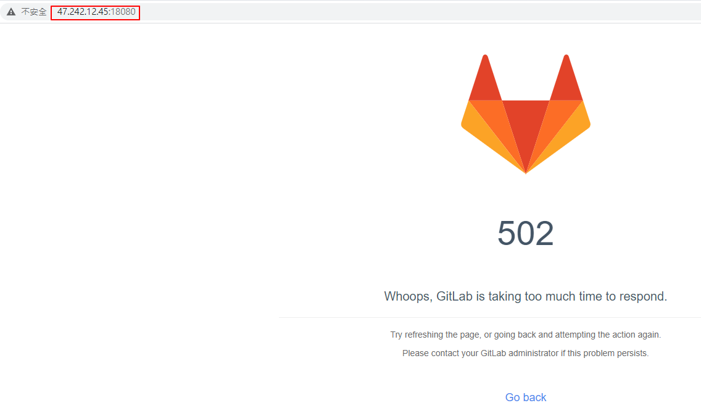

# 有檢查端口，都有開啟，但不知道為何報個502給我，接下來先使用本機vm上的centos再試一次

# 本機VM

- 安裝Docker，可以參考DockerStudy那篇
- 安裝Docker Compose，可以參考DockerStudy那篇

# 如上撰寫docker-compose.yml並啟動，修改部分端口

```shell
version: "3.6"
services:
  gitlab:
    image: gitlab/gitlab-ce:latest
    restart: always
    container_name: gitlab
    ports:
      - '8080:80'
      - '8443:443'
      - '8022:22'
    volumes:
      - '/gitlab/data:/var/opt/gitlab'
      - '/gitlab/logs:/var/log/gitlab'
      - '/gitlab/config:/etc/gitlab'
```

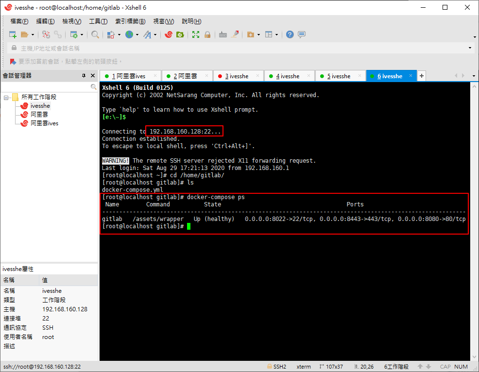

# 本機測試

http://192.168.160.128:8080

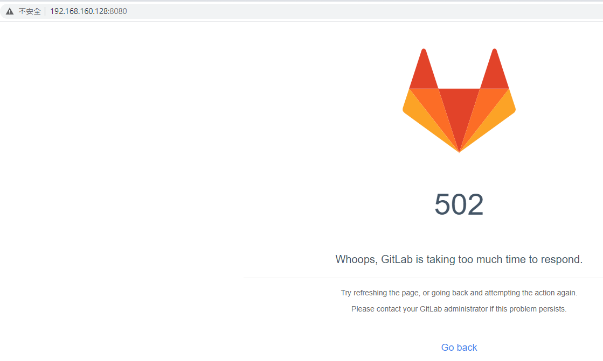

仍然失敗，這神了!!

後來查了一下，原來看到502這畫面，要再等一陣子，等gitlab服務完全開啟

這下成功了

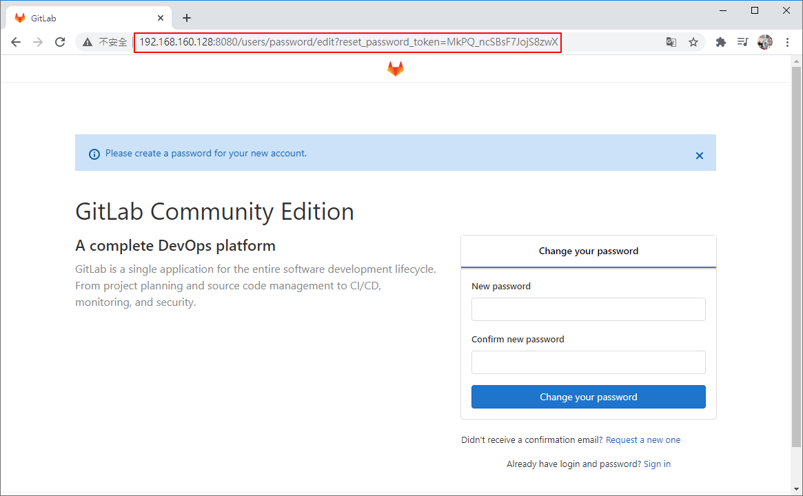

設定好root密碼，順利登入

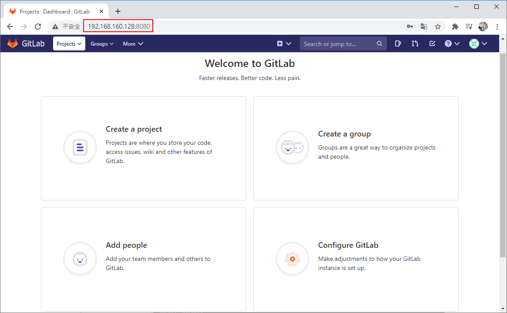

# 回頭再試了一次阿里雲

還是不成功，查了官方文檔說明，可能是阿里雲上目前的ECS硬體設備太差，所以失敗

[參考文檔](https://docs.gitlab.com/ce/install/requirements.html#hardware-requirements)

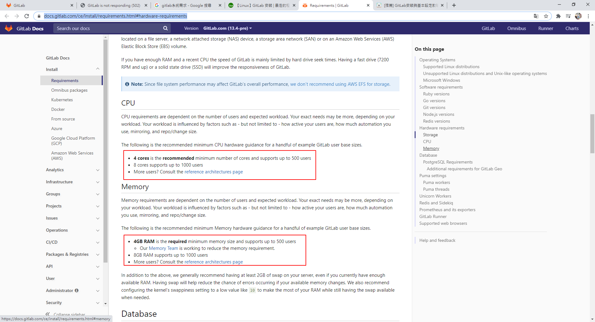

[阿里雲文檔](https://help.aliyun.com/document_detail/52857.html)

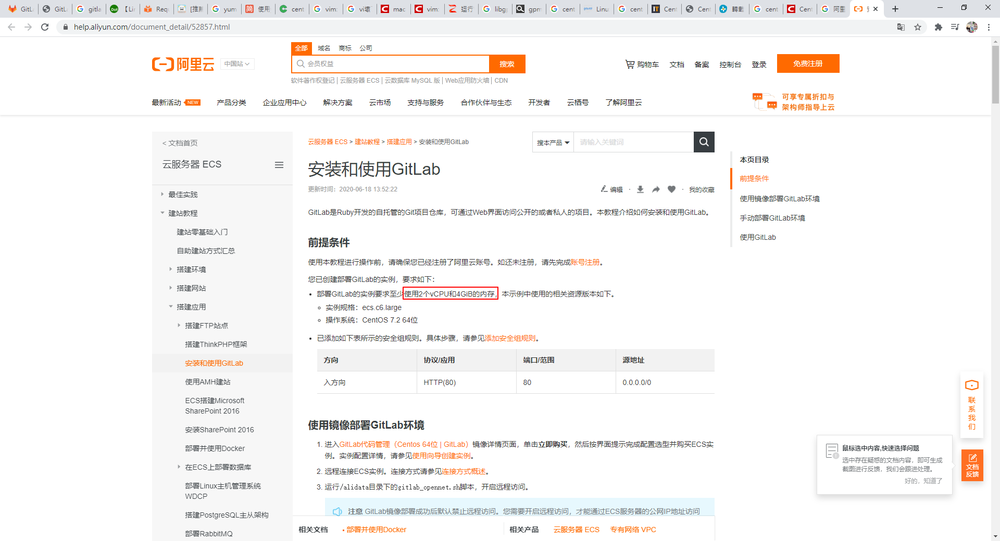


